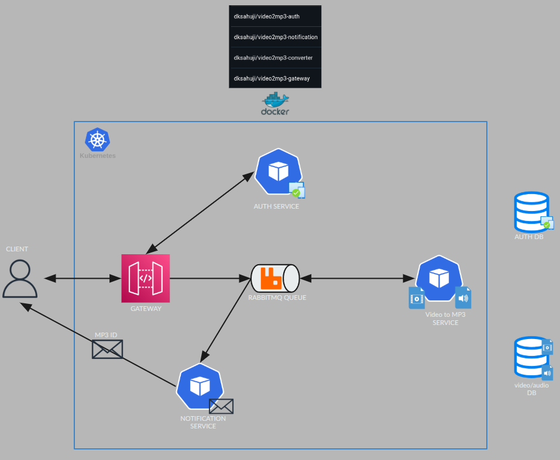

# Video2MP3 Microservices Project - Complete Guide

## Overview

A microservices-based video-to-MP3 conversion system built with Python, deployed on Kubernetes (minikube), featuring JWT authentication, RabbitMQ message queuing, and MongoDB/MySQL storage.

## Architecture



### Detailed Flow Diagram

```
┌─────────────────────────────────────────────────────────────┐
│                         CLIENT                               │
│            (curl / Browser / Mobile App)                     │
└────────────────────────┬────────────────────────────────────┘
                         │ HTTP Request (JWT Token)
                         ↓
┌─────────────────────────────────────────────────────────────┐
│                      GATEWAY SERVICE                         │
│                   (Flask, Port 8080)                         │
│  - Login Proxy                                               │
│  - JWT Validation                                            │
│  - Video Upload                                              │
│  - MP3 Download                                              │
└────┬──────────────┬─────────────┬──────────────┬────────────┘
     │              │             │              │
     │(login)       │(validate)   │(store)       │(queue)
     ↓              │             ↓              ↓
┌─────────────┐     │      ┌─────────────┐  ┌─────────────┐
│AUTH SERVICE │     │      │  MongoDB    │  │  RabbitMQ   │
│(Flask:5000) │     │      │(Host:27017) │  │(StatefulSet)│
│             │     │      │             │  │             │
│- JWT Gen    │◀────┘      │- GridFS     │  │- video queue│
│- JWT Valid  │            │  Videos     │  │- mp3 queue  │
│             │            │- GridFS MP3s│  │             │
└─────┬───────┘            └─────────────┘  └──────┬──────┘
      │                                            │
      │ MySQL Query                                │ Consume
      ↓                                            ↓
┌─────────────┐                          ┌─────────────────┐
│   MySQL     │                          │   CONVERTER     │
│(Host:3306)  │                          │   (4 Workers)   │
│             │                          │                 │
│- auth DB    │                          │- FFmpeg         │
│- user table │                          │- MoviePy        │
└─────────────┘                          │- Video→MP3      │
                                         └────────┬────────┘
                                                  │
                                                  │ Store MP3
                                                  ↓
                                         ┌─────────────────┐
                                         │   MongoDB       │
                                         │  (GridFS MP3)   │
                                         └────────┬────────┘
                                                  │
                                         Publish to mp3 queue
                                                  ↓
                                         ┌─────────────────┐
                                         │   RabbitMQ      │
                                         │   mp3 queue     │
                                         └────────┬────────┘
                                                  │ Consume
                                                  ↓
                                         ┌─────────────────┐
                                         │  NOTIFICATION   │
                                         │   (4 Workers)   │
                                         │                 │
                                         │- Gmail SMTP     │
                                         │- Send Email     │
                                         └────────┬────────┘
                                                  │
                                                  ↓
                                         ┌─────────────────┐
                                         │   User Email    │
                                         │                 │
                                         │ Subject:        │
                                         │ "MP3 Download"  │
                                         │                 │
                                         │ Body:           │
                                         │ "mp3 file_id:   │
                                         │  <ObjectId> is  │
                                         │  now ready!"    │
                                         └─────────────────┘
```

### Services

1. **Gateway** - Entry point, routes requests, publishes jobs to queue
2. **Auth** - JWT authentication, user validation
3. **Converter** - Consumes queue messages, converts video to MP3
4. **Notification** - Sends email notifications when MP3 is ready
5. **RabbitMQ** - Message queue for asynchronous processing
6. **MySQL** - User authentication data (runs on host)
7. **MongoDB** - Video/MP3 file storage (runs on host)

## Quick Start

### Prerequisites

- Docker
- Kubernetes (minikube)
- MySQL and MongoDB running on host
- kubectl configured for minikube cluster

### Start All Services

```bash
# From project root
./start-services.sh
```

This script:
- Stops any existing port forwards
- Cleans up old log files
- Prompts for sudo password (once)
- Starts gateway on port 80 (clean URLs!)
- Starts auth on port 5000
- Starts RabbitMQ on port 15672
- Shows URLs and PIDs for each service

### Test the System

```bash
# 1. Login (get JWT token)
curl -X POST -u "dksahuji@gmail.com:Admin123" http://video2mp3.com/login

# Returns: eyJhbGciOiJIUzI1NiIsInR5cCI6IkpXVCJ9...
```

### Stop All Services

```bash
sudo pkill -f 'kubectl port-forward'
```

## Service URLs

When port forwarding is active:

- **Gateway:** http://video2mp3.com/login or http://localhost/login
- **Auth:** http://localhost:5000
- **RabbitMQ Management:** http://localhost:15672 (guest/guest)
- **RabbitMQ (via domain):** http://rabbitmq-manager.com:15672

## Project Structure

```
video2mp3/
├── src/
│   ├── auth/                    # Authentication service
│   │   ├── server.py           # Flask app with JWT auth
│   │   ├── init.sql            # MySQL database initialization
│   │   ├── Dockerfile
│   │   ├── manifests/          # Kubernetes configs
│   │   ├── solution-auth-login.md  # Comprehensive debugging guide
│   │   └── run-auth-test.sh    # Test script
│   │
│   ├── gateway/                 # API Gateway service
│   │   ├── server.py           # Flask gateway
│   │   ├── storage/util.py     # GridFS file storage
│   │   ├── auth_svc/access.py  # Auth service proxy
│   │   ├── auth/validate.py    # Token validation
│   │   ├── Dockerfile
│   │   └── manifests/          # Kubernetes configs
│   │
│   ├── converter/               # Video to MP3 converter
│   │   ├── consumer.py         # RabbitMQ consumer
│   │   ├── convert/
│   │   │   └── to_mp3.py      # Conversion logic
│   │   ├── Dockerfile
│   │   └── manifests/          # Kubernetes configs
│   │
│   ├── notification/            # Email notification service
│   │   ├── consumer.py         # RabbitMQ consumer
│   │   ├── send/
│   │   │   └── email.py        # Email sending logic
│   │   ├── Dockerfile
│   │   └── manifests/          # Kubernetes configs
│   │
│   └── rabbitMQ/               # Message queue
│       ├── manifests/          # RabbitMQ StatefulSet
│       ├── ingress.yaml
│       └── solution tunnel.md  # Port forwarding guide
│
├── start-services.sh           # Quick start script
├── DEBUGGING-GUIDE.md          # Complete debugging reference
└── README-COMPLETE.md          # This file
```

## Documentation

### Essential Reading

1. **[DEBUGGING-GUIDE.md](./DEBUGGING-GUIDE.md)** - Comprehensive debugging guide covering:
   - All issues encountered and solutions
   - Debugging methodologies
   - Common pitfalls and lessons learned
   - Tool usage and troubleshooting checklists

2. **[src/auth/solution-auth-login.md](./src/auth/solution-auth-login.md)** - Auth service specific guide:
   - Route decorator bug fix
   - MySQL connectivity issues
   - Port 80 forwarding with sudo
   - Complete debugging journey

3. **[src/rabbitMQ/solution tunnel.md](./src/rabbitMQ/solution tunnel.md)** - Networking guide:
   - Why minikube tunnel shows empty services
   - Ingress vs Port Forwarding
   - Traffic flow diagrams

## Key Concepts Learned

### 1. Docker Images are Immutable

**Problem:** Changed local code but pods still ran old code.

**Solution:** Rebuild and push Docker image, then restart deployment.

```bash
cd src/auth
docker build -t dksahuji/video2mp3-auth:latest .
docker push dksahuji/video2mp3-auth:latest
kubectl rollout restart deployment/auth
```

**Verification:**
```bash
kubectl exec deployment/auth -- cat /app/server.py | grep "def login"
```

### 2. Kubernetes Networking

**Key Points:**
- Pods can't reach `localhost` on host machine
- Minikube pods see host at `192.168.49.1`
- Services communicate via cluster DNS: `service-name:port`
- External access requires: Ingress, NodePort, LoadBalancer, or port forwarding

**Example ConfigMap:**
```yaml
env:
  - name: MYSQL_HOST
    value: "192.168.49.1"  # Host machine from minikube perspective
  - name: MYSQL_PORT
    value: "3306"
```

### 3. MySQL Configuration for Kubernetes

For pods to access MySQL on host:

**A. Bind Address**
```bash
# /etc/mysql/mysql.conf.d/mysqld.cnf
bind-address = 0.0.0.0  # Not 127.0.0.1!
```

**B. User Permissions**
```sql
-- Not just localhost!
CREATE USER 'auth_user'@'192.168.49.%' IDENTIFIED BY 'Auth123';
GRANT ALL PRIVILEGES ON auth.* TO 'auth_user'@'192.168.49.%';
FLUSH PRIVILEGES;
```

**C. Restart MySQL**
```bash
sudo systemctl restart mysql
```

### 4. Port Forwarding vs Ingress

**Port Forwarding (Development):**
- Simple and fast
- Direct tunnel: localhost → pod
- Bypasses Ingress
- Requires manual start/stop
- ✅ Used in this project

**Ingress (Production-like):**
- More complex setup
- Routes based on hostname/path
- Requires Ingress controller
- More realistic for production testing

### 5. Privileged Ports and Sudo

**Problem:** Port 80 requires root privileges

**Solutions:**

**Option A: Use Port 80 with Sudo (CHOSEN)**
```bash
# Clean URLs: http://video2mp3.com/login
sudo -E env "PATH=$PATH" kubectl port-forward service/gateway 80:8080 &
```

**Option B: Use Port 8080 (No Sudo)**
```bash
# URLs need port: http://video2mp3.com:8080/login
kubectl port-forward service/gateway 8080:8080 &
```

**Key Learning:** Use `sudo -E env "PATH=$PATH"` to preserve user's kubectl config when using sudo.

### 6. The sudo Environment Issue

**Problem:** `sudo kubectl` couldn't find cluster config

**Why:** Root user has different HOME directory, so looks in `/root/.kube/config` instead of `/home/user/.kube/config`

**Solution:**
```bash
sudo -E env "PATH=$PATH" kubectl ...
```
- `-E`: Preserve environment variables (including HOME)
- `env "PATH=$PATH"`: Ensure kubectl binary is found

## Common Issues and Quick Fixes

### 404 on /login Endpoint

```bash
# Check deployed code
kubectl exec deployment/auth -- cat /app/server.py | grep -B 1 "def login"

# Should show: @server.route("/login", methods=["POST"])
# If missing @, rebuild image:
cd src/auth && docker build -t dksahuji/video2mp3-auth:latest . && docker push dksahuji/video2mp3-auth:latest
kubectl rollout restart deployment/auth
```

### MySQL Connection Refused

```bash
# Check MySQL bind address
cat /etc/mysql/mysql.conf.d/mysqld.cnf | grep bind-address
# Should be: 0.0.0.0

# Check MySQL is listening
ss -tlnp | grep 3306
# Should show: 0.0.0.0:3306

# Check user permissions
sudo mysql -u root -e "SELECT User, Host FROM mysql.user WHERE User='auth_user';"
# Should include: auth_user | 192.168.49.%
```

### Port Forward Not Working

```bash
# Check if running
ps aux | grep "kubectl port-forward"

# Check logs
tail -f /tmp/gateway-pf.log

# Restart
sudo pkill -f 'kubectl port-forward'
./start-services.sh
```

### Permission Denied on Log Files

```bash
# Log files owned by root from previous runs
ls -la /tmp/*-pf.log

# Fix: Clean up and restart
sudo rm -f /tmp/*-pf.log
./start-services.sh
```

## Debugging Tools and Commands

### View Pod Logs
```bash
kubectl logs -l app=auth --tail=50 -f
kubectl logs -l app=gateway --tail=50 -f
kubectl logs -l app=converter --tail=50 -f
```

### Inspect Running Pods
```bash
# Check pod status
kubectl get pods

# Describe pod
kubectl describe pod <pod-name>

# Shell into pod
kubectl exec -it deployment/auth -- /bin/bash

# View file in pod
kubectl exec deployment/auth -- cat /app/server.py
```

### Test Connectivity
```bash
# From host to minikube
nc -zv 192.168.49.2 80

# From pod to host MySQL
kubectl exec deployment/auth -- nc -zv 192.168.49.1 3306

# HTTP endpoint test
curl -v http://localhost:5000/login
```

### MySQL Debugging
```bash
# Test connection from host
mysql -u auth_user -pAuth123 -h 192.168.49.1 auth -e "SELECT * FROM user;"

# Test from pod
kubectl exec -it deployment/auth -- mysql -u auth_user -pAuth123 -h 192.168.49.1 auth -e "SELECT * FROM user;"

# Check MySQL logs
sudo tail -f /var/log/mysql/error.log
```

## Development Workflow

### Making Code Changes

1. **Edit local code**
   ```bash
   vim src/auth/server.py
   ```

2. **Rebuild Docker image**
   ```bash
   cd src/auth
   docker build -t dksahuji/video2mp3-auth:latest .
   docker push dksahuji/video2mp3-auth:latest
   ```

3. **Restart deployment**
   ```bash
   kubectl rollout restart deployment/auth
   kubectl rollout status deployment/auth
   ```

4. **Verify changes**
   ```bash
   kubectl exec deployment/auth -- cat /app/server.py | grep "your change"
   ```

### End-to-End Testing

Complete workflow from upload to download:

1. **Login and get token**
   ```bash
   TOKEN=$(curl -X POST -u "dksahuji@gmail.com:Admin123" http://video2mp3.com/login 2>/dev/null)
   echo $TOKEN
   ```

2. **Upload video file**
   ```bash
   curl -X POST -F "file=@./agentic_ai-using-external-feedback.mp4" \
     -H "Authorization: Bearer $TOKEN" \
     http://video2mp3.com/upload
   ```

3. **Monitor conversion**
   ```bash
   # Watch converter process the video
   kubectl logs -l app=converter -f
   ```

4. **Monitor notification**
   ```bash
   # Watch notification service send email
   kubectl logs -l app=notification -f
   ```

5. **Check your email for mp3_fid**
   - Email subject: "MP3 Download"
   - Email body: "mp3 file_id: <ObjectId> is now ready!"

6. **Download the MP3**
   ```bash
   # Replace <file_id> with the ObjectId from email
   curl --output converted.mp3 -X GET \
     -H "Authorization: Bearer $TOKEN" \
     "http://video2mp3.com/download?fid=<file_id>"
   ```

### Testing Changes

1. **Check pod is running**
   ```bash
   kubectl get pods -l app=auth
   ```

2. **View logs**
   ```bash
   kubectl logs -l app=auth --tail=50 -f
   ```

3. **Test endpoint**
   ```bash
   curl -X POST -u "dksahuji@gmail.com:Admin123" http://video2mp3.com/login
   ```

## Troubleshooting Checklist

When something breaks:

- [ ] Are pods running? `kubectl get pods`
- [ ] What do logs say? `kubectl logs <pod-name>`
- [ ] Is port forwarding active? `ps aux | grep port-forward`
- [ ] Can I reach the endpoint? `curl -v <url>`
- [ ] Does deployed code match local? `kubectl exec -- cat /app/file.py`
- [ ] Can pod reach dependencies? `kubectl exec -- nc -zv host port`
- [ ] Are MySQL permissions correct? Check User/Host in mysql.user table
- [ ] Is MySQL listening on 0.0.0.0? Check with `ss -tlnp | grep 3306`
- [ ] Are log files owned by root? `ls -la /tmp/*-pf.log`
- [ ] Did I rebuild and push Docker image after code changes?
- [ ] Is .env configured correctly? No quotes around values
- [ ] Are Gmail credentials valid? Check notification service logs

## Lessons Learned (Summary)

1. **Always verify deployed code** - Docker images don't auto-update
2. **Kubernetes networking is different** - Use 192.168.49.1 to reach host
3. **MySQL bind-address matters** - Use 0.0.0.0 for external access
4. **Check logs after every command** - Background processes hide errors
5. **Use sudo -E for kubectl** - Preserves user's environment
6. **Port forwarding is simple** - Great for local development
7. **Test connectivity with nc** - Faster than testing full application
8. **Verify each step** - Don't assume earlier fixes worked
9. **No quotes in .env files** - envsubst adds quotes; quotes in .env cause YAML errors
10. **Use Gmail App Passwords** - Regular passwords don't work for SMTP authentication

## Contributing

### Adding Documentation

Found a new issue? Document it in the appropriate guide:

- **General debugging:** Add to `DEBUGGING-GUIDE.md`
- **Auth-specific:** Add to `src/auth/solution-auth-login.md`
- **Networking/port-forward:** Add to `src/rabbitMQ/solution tunnel.md`

### Bug Reports

When reporting bugs, include:
1. Symptom (what doesn't work)
2. Commands run (exact commands)
3. Output/errors (full output)
4. Logs (pod logs, port forward logs)
5. What you've tried

### Testing Changes

Before committing:
```bash
# 1. Start services
./start-services.sh

# 2. Run auth test
cd src/auth
./run-auth-test.sh

# 3. Check pods are healthy
kubectl get pods

# 4. Test login
curl -X POST -u "dksahuji@gmail.com:Admin123" http://video2mp3.com/login

# 5. Clean up
sudo pkill -f 'kubectl port-forward'
```

## References

- [Kubernetes Documentation](https://kubernetes.io/docs/)
- [Minikube Documentation](https://minikube.sigs.k8s.io/docs/)
- [Docker Documentation](https://docs.docker.com/)
- [RabbitMQ Documentation](https://www.rabbitmq.com/documentation.html)
- [Flask Documentation](https://flask.palletsprojects.com/)
- [MoviePy Documentation](https://zulko.github.io/moviepy/)
- [Pika Documentation](https://pika.readthedocs.io/)

## License

[Your License Here]

## Authors

[Your Name Here]

---

**Need help?** Check the [DEBUGGING-GUIDE.md](./DEBUGGING-GUIDE.md) first!
