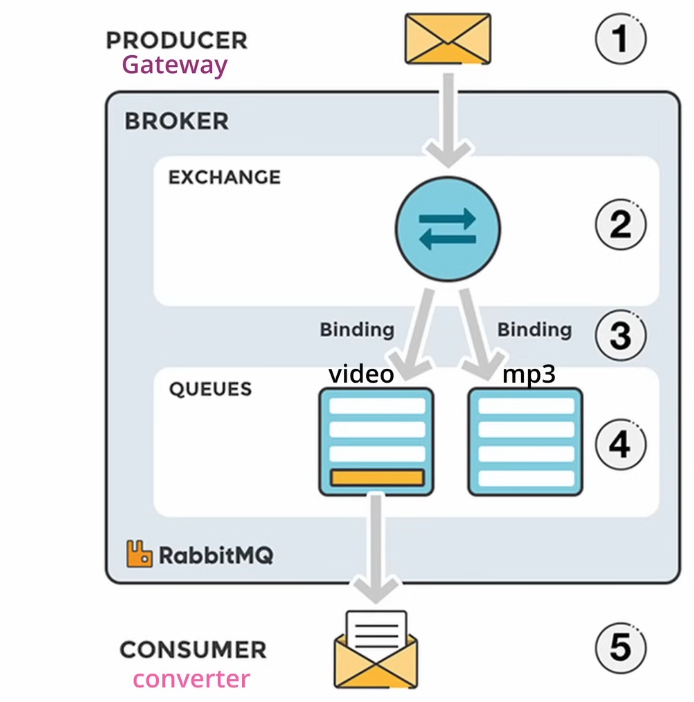
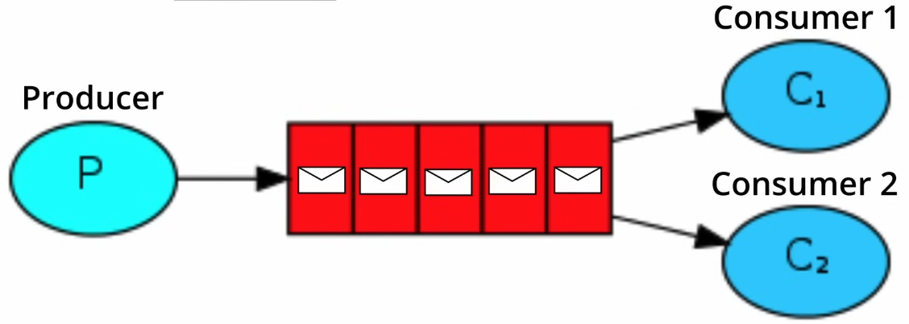
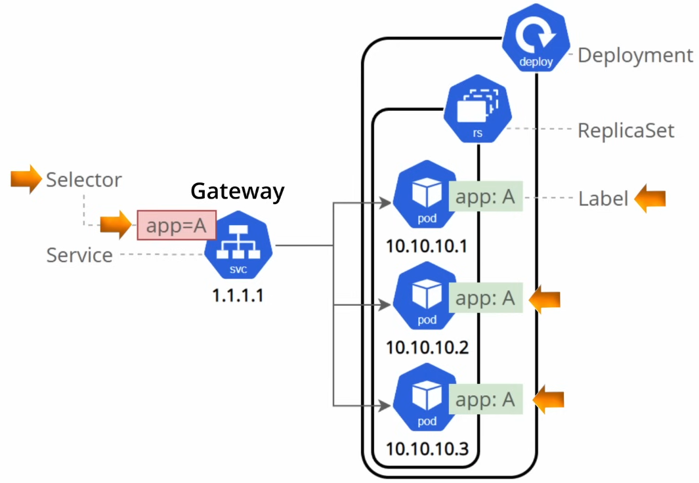
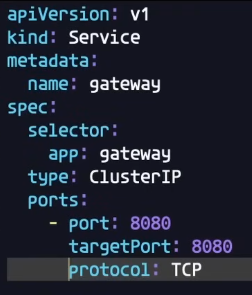
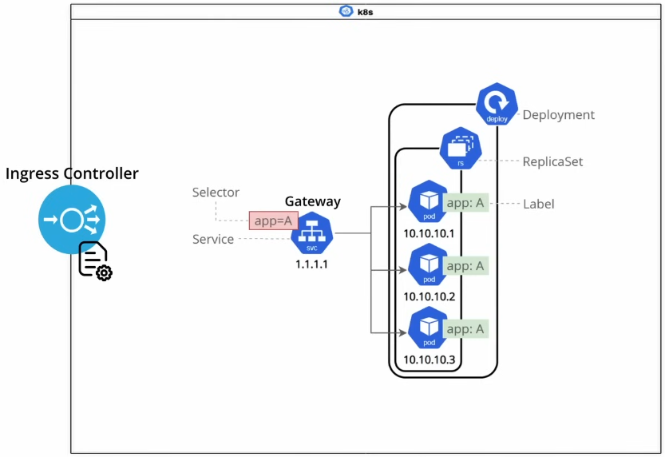
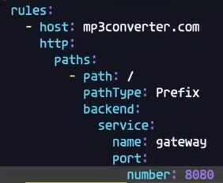
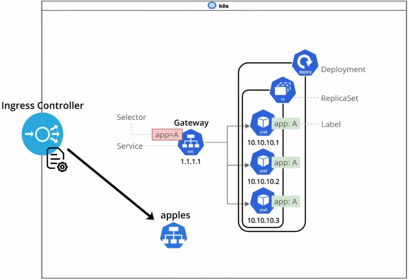

round-robin by default

In configmap.yaml
This AUTH_SVC_ADDRESS: "auth:5000" means use address of auth service

In service.yaml
ClusterIP will give an internal IP address to the cluster
gateway should be capable of being accessed from outside so we create an ingress.

### What is a service?

### What is Ingress?

#### Rules

There could be another website which sends request to another service based on rules.

# More steps
- sudo vim /etc/hosts
- add '127.0.0.1 video2mp3.com'
- minikube start
- minikube addons list
- minikube addons enable ingress
- minikube tunnel (to tunnel ingress video2mp3.com)